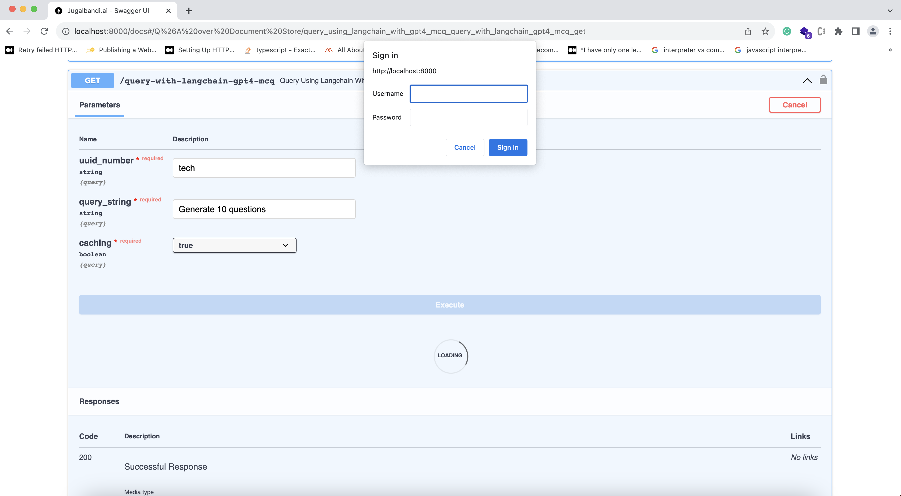

# Activity Sakhi API : 

A powerful service designed to enhance the educational experience for both parents and teachers. Our service revolves around a curated collection of documents focused on children's activities and curriculum frameworks. With simplicity at its core, "Activity Sakhi" empowers parents and teachers to effortlessly discover relevant content and find answers to audience-specific questions.

### Key Features:
#### Rich Content Repository: 
Explore a predefined set of documents tailored to children's activities and curriculum frameworks, ensuring a wealth of valuable information at your fingertips.
#### Audience-Centric: 
Targeted specifically for parents and teachers, "Activity Sakhi" caters to their unique needs, providing insights and resources tailored to enhance the learning journey.
Discover and Learn: Seamlessly discover engaging content and obtain answers to your specific questions, making the educational process more accessible and enjoyable.

Whether you're a parent looking for creative activities or a teacher seeking curriculum support, Activity Sakhi is your go-to solution. Unlock the potential of educational resources and make learning a delightful experience for children.

### Getting Started:
Integrate "Activity Sakhi" effortlessly into your applications to revolutionize the way parents and teachers engage with educational content. Check out our documentation to get started and embark on a journey of enriched learning experiences.

### Prerequisites

- **Python 3.7 or higher**
- Latest Docker
- Redis


### [Marqo database setup](https://marqo.pages.dev/1.5.1/#setup-and-installation)

1. To get the Marqo image, use the following command:

```shell
docker pull marqoai/marqo:1.5.1
```

2. To create the Marqo instance, run the following command:

```shell
docker rm -f marqo;docker run --name marqo -it --privileged -p 8882:8882 --add-host host.docker.internal:host-gateway -e "MARQO_MAX_INDEX_FIELDS=400" -e "MARQO_MAX_DOC_BYTES=200000" -e "MARQO_MAX_RETRIEVABLE_DOCS=600" -e "MARQO_MAX_NUMBER_OF_REPLICAS=2" -e "MARQO_MODELS_TO_PRELOAD=[\"flax-sentence-embeddings/all_datasets_v4_mpnet-base\"]" marqoai/marqo:1.5.1
```


# 🔧 1. Installation

To use the code, you need to follow these steps:

1. Clone the repository from GitHub: 
    
    ```bash
    git clone https://github.com/DJP-Digital-Jaaduii-Pitara/sakhi-api-service.git
    ```
   
    ```
   cd sakhi-api-service
   ```

2. The code requires **Python 3.7 or higher** and some additional python packages. To install these packages, run the following command in your terminal:

    ```bash
    pip install -r requirements-dev.txt
    ```

3. To ingest data to marqo

    ```bash
    python3 index_documents.py --marqo_url=<MARQO_URL> --index_name=<MARQO_INDEX_NAME> --folder_path=<PATH_TO_INPUT_FILE_DIRECTORY> --fresh_index
    ```
   --fresh_index: This is a flag that creating a new index or overwriting an existing one. Fresh indexing typically starts from scratch without using existing data.
   PATH_TO_INPUT_FILE_DIRECTORY should have only PDF, audio, video and txt file only.
   
   e.g.
   ```bash
   python3 index_documents.py --marqo_url=http://0.0.0.0:8882 --index_name=sakhi_parent_activities --folder_path=parent_pdfs --fresh_index
   python3 index_documents.py --marqo_url=http://0.0.0.0:8882 --index_name=sakhi_teacher_activities --folder_path=teacher_pfs --fresh_index
   ```
   Create the index by using the above command. After creating the index add the index name in `config.ini` file.

   ```json
      indices = {
         "parent":"<PARENT_INDEX_NAME>",
         "teacher": "<TEACHER_INDEX_NAME>"
      }
   ```

4. You will need Cloud storage account to store the audio file for response. (Supported - OCI, GCP, AWS)

5. create another file **.env** which will hold the development credentials and add the following variables. Update the Azure OpenAI details, OCI details, Bhashini endpoint URL and API key.

   ```bash
   SERVICE_ENVIRONMENT=<name_of_the_environment>
   LOG_LEVEL=<log_level> # INFO, DEBUG, ERROR
   CONFIG_INI_PATH=<your_config.ini_file_path>
   MARQO_URL=<your_marqo_db_url> 

   #Redis Database
   REDIS_HOST=localhost
   REDIS_PORT=6379
   REDIS_DB=0

   #Telemetry
   TELEMETRY_ENDPOINT_URL=<telemetry_endpoint_url>
   TELEMETRY_LOG_ENABLED=<telemetry_enable_or_disable> # true or false

   #LLM
   LLM_TYPE=<llm_type> #openai, azure, ollama
   OPENAI_API_KEY=<your_openai_api_key>
   GPT_MODEL=<your_gpt_model>

   #Translation
   TRANSLATION_TYPE=<translation_type> #bhashini, google, dhruva
   BHASHINI_ENDPOINT_URL=<your_bhashini_api_endpoint>
   BHASHINI_API_KEY=<your_bhashini_api_key>

   #Storage
   BUCKET_TYPE=<bucket_type> #oci, gcp, aws
   BUCKET_ENDPOINT_URL=<your_bucket_endpoint_url>
   BUCKET_REGION_NAME=<your_bucket_region_name>
   BUCKET_NAME=<your_bucket_name>
   BUCKET_SECRET_ACCESS_KEY=<your_bucket_secret_access_key>
   BUCKET_ACCESS_KEY_ID=<your_bucket_access_key_id>
   ```

# 🏃🏻 2. Running

Once the above installation steps are completed, run the following command in home directory of the repository in terminal

```bash
uvicorn main:app
```
Open your browser at http://127.0.0.1:8000/docs to access the application.

The command `uvicorn main:app` refers to:

- `main`: the file `main.py` (the Python "module").
- `app`: the object created inside of `main.py` with the line `app = FastAPI()`.
- `--reload`:  make the server restart after code changes. Only do this for development.
    ```bash
    uvicorn main:app --reload
    ```




# 📃 3. API Specification and Documentation

### `POST /v1/query`

#### API Function
API is used to generate activity/story based on user query and translation of text/audio from one language to another language in text/audio format. To achieve the same, Language Services has been integrated. Cloud object storage has been used to store translated audio files when audio is chosen as target output format. 

```commandline
curl -X 'POST' \
  'http://127.0.0.1:8000/v1/query' \
  -H 'accept: application/json' \
  -H 'Content-Type: application/json' \
  -d '{
  "input": {
    "language": "en",
    "text": "string",
    "audio": "string",
    "audienceType": "teacher"
  },
  "output": {
    "format": "text"
  }
}'
```

#### Request
| Request Input       | Value                                                     |
|:--------------------|-----------------------------------------------------------|
| `input.language`    | en,bn,gu,hi,kn,ml,mr,or,pa,ta,te                          |
| `input.text`        | User entered question (any of the above language)         |
| `input.audio`       | Public file URL Or Base64 encoded audio                   |
| `input.audienceType` | parent, teacher (default value is parent, if not passing) |
| `output.format`      | text or audio                                             |

Required inputs are `text`, `audio` and `language`.

Either of the `text`(string) or `audio`(string) should be present. If both the values are given, `text` is taken for consideration. Another requirement is that the `language` should be same as the one given in text and audio (i.e, if you pass English as `language`, then your `text/audio` should contain queries in English language). The audio should either contain a publicly downloadable url of mp3 file or base64 encoded text of the mp3.
If output format is given as `text` than response will return `text` format only. If output format is given as `audio` than response will return `text` and `audio` both.

```json
{
   "input": {
      "text": "How to Teach Kids to Play Games", 
      "language": "en"
   },
   "output": {
      "format": "text"
   }
}
```

#### Successful Response

```json
{
   "output": {
      "text": "string",
      "audio": "string",
      "language": "en",
      "format": "text|audio"
   }
}
```

#### What happens during the API call?

Once the API is hit with proper request parameters, it is then checked for the presence of query text. 

If query text is present, the translation of query text based on input language is done. Then the translated query text is given to langchain model which does the same work. Then the paraphrased answer is again translated back to input_language. If the output_format is voice, the translated paraphrased answer is then converted to a mp3 file and uploaded to supported cloud storage folder and made public.

If the query text is absent and audio url is present, then the audio url is downloaded and converted into text based on the input language. Once speech to text conversion in input language is finished, the same process mentioned above happens. One difference is that by default, the paraphrased answer is converted to voice irrespective of the output_format since the input format is voice.

### `POST /v1/chat`

#### API Function
API is used to generate activity/story based on user query and translation of text/audio from one language to another language in text/audio format. To achieve the same, Language Services has been integrated. Cloud object storage has been used to store translated audio files when audio is chosen as target output format.

```commandline
curl -X 'POST' \
  'http://127.0.0.1:8000/v1/chat' \
  -H 'accept: application/json' \
  -H 'Content-Type: application/json' \
  -d '{
  "input": {
    "language": "en",
    "text": "string",
    "audio": "string",
    "context": "parent"
  },
  "output": {
    "format": "text"
  }
}'
```

#### Request
| Request Input       | Value                                                     |
|:--------------------|-----------------------------------------------------------|
| `input.language`    | en,bn,gu,hi,kn,ml,mr,or,pa,ta,te                          |
| `input.text`        | User entered question (any of the above language)         |
| `input.audio`       | Public file URL Or Base64 encoded audio                   |
| `input.context`     | parent, teacher (default value is parent, if not passing) |
| `output.format`     | text or audio                                             |

Required inputs are `text`, `audio` and `language`.

Either of the `text`(string) or `audio`(string) should be present. If both the values are given, `text` is taken for consideration. Another requirement is that the `language` should be same as the one given in text and audio (i.e, if you pass English as `language`, then your `text/audio` should contain queries in English language). The audio should either contain a publicly downloadable url of mp3 file or base64 encoded text of the mp3.
If output format is given as `text` than response will return `text` format only. If output format is given as `audio` than response will return `text` and `audio` both.

```json
{
   "input": {
      "text": "How to Teach Kids to Play Games", 
      "language": "en"
   },
   "output": {
      "format": "text"
   }
}
```

#### Successful Response

```json
{
   "output": {
      "text": "string",
      "audio": "string",
      "language": "en",
      "format": "text|audio"
   }
}
```

#### What happens during the API call?

Once the API is hit with proper request parameters, it is then checked for the presence of query text. 

When a query is provided as text, the system first checks the language. If it's not English, the query is translated. Then, the translated query and the user's past interactions are sent to a large language model (LLM) to generate a refined query for retrieving relevant documents from a vector store.The retrieved documents are filtered based on a set score. These documents and the refined query are again sent to the LLM to generate the final answer.
Finally, the answer is translated back to the original language if necessary. If the output format is voice, the translated answer is converted to an MP3 file, uploaded to a public cloud storage folder.

If the query text is absent and audio url is present, then the audio url is downloaded and converted into text based on the input language. Once speech to text conversion in input language is finished, the same process mentioned above happens. One difference is that by default, the paraphrased answer is converted to voice irrespective of the output_format since the input format is voice.

# 🚀 4. Deployment

This repository comes with a Dockerfile. You can use this dockerfile to deploy your version of this application to Cloud Run.
Make the necessary changes to your dockerfile with respect to your new changes. (Note: The given Dockerfile will deploy the base code without any error, provided you added the required environment variables (mentioned in the `.env` file) to either the Dockerfile or the cloud run revision)


# 5. Configuration (config.ini)

| Variable                        | Description                                                                                    | Default Value                        |
|:--------------------------------|------------------------------------------------------------------------------------------------|--------------------------------------|
| database.indices                | index or collection name to be referred to from vector database based on input audienceType    |                                      |
| database.top_docs_to_fetch      | Number of filtered documents retrieved from vector database to be passed to Gen AI as contexts | 5                                    |
| database.docs_min_score         | Minimum score of the documents based on which filtration happens on retrieved documents        | 0.4                                  |
| redis.ttl         | Redis cache expiration time for a key in seconds. (Only applicable for `/v1/chat` API.)        | 43200                               |
| request.supported_lang_codes    | Supported languages by the service                                                             | en,bn,gu,hi,kn,ml,mr,or,pa,ta,te     |
| request.support_response_format | Supported response formats                                                                     | text,audio                           |
| request.support_audience_type | index name to be referred to from vector database based on audience type                                                                  | teacher, parent (Default)                           |
| llm.max_messages                   | Maximum number of messages to include in conversation history                                      |    4 |
| llm.enable_bot_intent           | Flag to enable or disable verification of user's query to check if it is referring to bot      | false                                |
| llm.intent_prompt               | System prompt to Gen AI to verify if the user's query is referring to the bot                  |                                      |
| llm.bot_prompt                  | System prompt to Gen AI to generate responses for user's query related to bot                  |                                      |
| llm.activity_prompt             | System prompt to Gen AI to generate responses based on user's query and input contexts         |                                      |
| llm.chat_intent_prompt          | System prompt to Gen AI to generate standalone query based on user's previous history and input contexts         |                                      |
| telemetry.telemetry_log_enabled | Flag to enable or disable telemetry events logging to Sunbird Telemetry service                | true                                 |
| telemetry.environment           | service environment from where telemetry is generated from, in telemetry service               | dev                                  |
| telemetry.service_id            | service identifier to be passed to Sunbird telemetry service                                   |                                      |
| telemetry.service_ver           | service version to be passed to Sunbird telemetry service                                      |                                      |
| telemetry.actor_id              | service actor id to be passed to Sunbird telemetry service                                     |                                      |
| telemetry.channel               | channel value to be passed to Sunbird telemetry service                                        |                                      |
| telemetry.pdata_id              | pdata_id value to be passed to Sunbird telemetry service                                       |                                      |
| telemetry.events_threshold      | telemetry events batch size upon which events will be passed to Sunbird telemetry service      | 5                                    |


## Feature request and contribution

*   We are currently in the alpha stage and hence need all the inputs, feedbacks and contributions we can.
*   Kindly visit our project board to see what is it that we are prioritizing.

 
